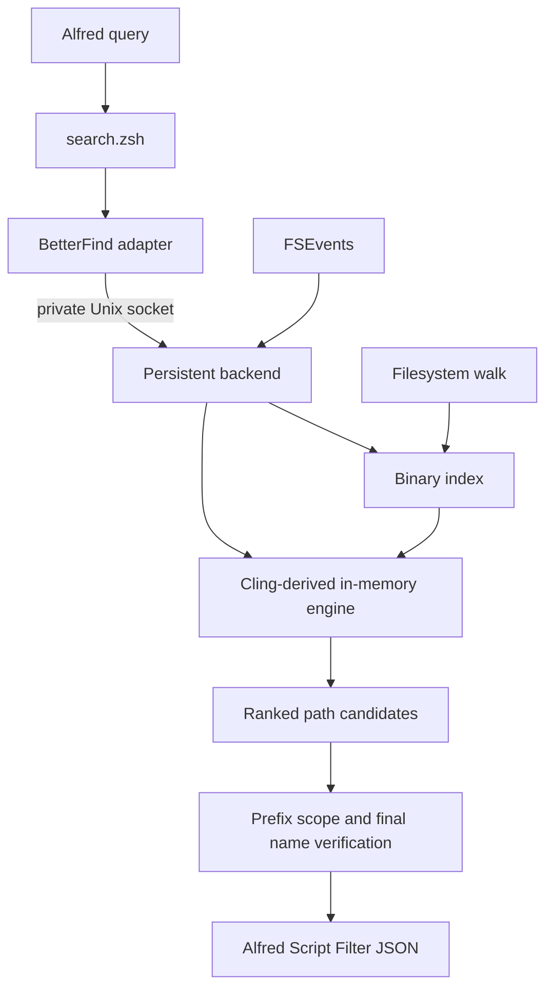

# Better Find

**Better Find** is an Apple Silicon-only Alfred workflow for very fast local file and folder search. It keeps a compact Cling-derived index ready in memory, updates it with macOS FSEvents, and returns native Alfred file results without using Spotlight or requiring a separate search application.

## Origins

Better Find began with the file-search experience in [Pearcleaner](https://github.com/alienator88/Pearcleaner) as the inspiration for its first implementation and Alfred-focused interaction. Its indexing and ranking architecture was later rebuilt around GPL-licensed search-engine code derived from [Cling](https://github.com/FuzzyIdeas/Cling).

Better Find is a separate project and brand. It does not include Pearcleaner’s application-management features or Cling’s GUI, commercial functionality, branding, or license-management code. Code originally released under the predecessor name **Pearfind** retains its historical MIT notice in `LICENSE-MIT`.

## What it does

- Searches file and folder names while you type in Alfred.
- Supports smart fuzzy matching and a contiguous “name contains” matcher.
- Restricts any query to files or folders with lightweight prefixes.
- Keeps its index current using live filesystem events and offline event replay.
- Opens results, reveals them in Finder, copies paths, previews through Quick Look, or opens folders in a chosen terminal application.
- Runs entirely inside the Alfred workflow; there is no public standalone CLI to install or maintain.

## Requirements

- Apple Silicon Mac (`arm64`)
- macOS 13 or newer
- Alfred 5 with the Powerpack
- Xcode Command Line Tools when building from source
- Full Disk Access for Alfred when protected locations must be indexed

Intel binaries, universal packaging, code signing, and notarization are intentionally outside this project’s scope.

## Build and install

From the repository root:

```zsh
chmod +x build-workflow.sh
./build-workflow.sh
open dist/BetterFind.alfredworkflow
```

The build creates ARM64-only release binaries, validates the workflow plist, bundles license notices and complete corresponding source, and produces `dist/BetterFind.alfredworkflow`.

My project uses the bundle ID `com.betterfind.workflow`. It therefore has an independent Alfred settings/data namespace and builds a new index instead of silently reusing an older Pearfind index. Remove the old workflow and its workflow data through Alfred if you no longer need them.

## Usage

The default Alfred keyword is `bf`:

```text
bf annual report
bf /annual report
bf \projects
bf 'apple
bf '/apple
bf '\apple
```

Smart fuzzy search is always the default. Prefixes can be used alone or combined; there are no static search-mode or filter settings.

| Query | Behavior |
|---|---|
| `apple` | Smart fuzzy search across files and folders |
| `/apple` | Smart fuzzy search, files only |
| `\apple` | Smart fuzzy search, folders only |
| `'apple` | Name contains `apple`, files and folders |
| `'/apple` | Name contains `apple`, files only |
| `'\apple` | Name contains `apple`, folders only |

Contained matching is contiguous: `'apple` can match `apple`, `pineapple`, `apple-notes`, and `my-apple-file`. Matching is case-insensitive by default, so capitalization and camel case do not prevent a match.

### Actions

- `Return` — Open the selected file or folder
- `Command-Return` — Reveal the result in Finder
- `Option-Return` — Copy the full path
- `Control-Return` — On folders only, open the configured terminal application at that folder
- Alfred Quick Look — Preview through Alfred’s normal file-result behavior

## Configuration and defaults

Open **Alfred Preferences → Workflows → Better Find → Configure Workflow**.

| Setting | Default |
|---|---|
| Search command | `bf` |
| Search root | Home folder (`~`) |
| Search subfolders | Enabled |
| Include hidden items | Disabled |
| Case-sensitive matching | Disabled |
| Terminal application | macOS Terminal |
| Exclude protected system folders at a disk root | Enabled |
| Result limit | `100` |
| Sort | Relevance, descending |

Default disk-root exclusions are `System`, `private`, `usr`, `bin`, `sbin`, `cores`, `dev`, and `etc`. Expensive home-library trees such as caches, containers, application support, developer data, and Spotlight metadata are also excluded by default. Both lists are editable YAML sequences; use `[]` for no exclusions.

Changing the root, recursion, hidden-item, system-folder, or excluded-path settings changes index compatibility and starts a replacement build. Query prefixes, sorting, result limits, case sensitivity, and terminal choice do not rebuild the index.

## Where Better Find is strong

- **Interactive latency:** the persistent backend avoids reopening and decoding the index for every keystroke.
- **Filename discovery:** fuzzy scoring handles incomplete, abbreviated, and multi-word names well.
- **macOS integration:** native file icons, Alfred actions, FSEvents, Finder, Quick Look, and a native terminal-app picker.
- **Large roots:** compact binary storage, bitmask candidate filtering, SIMD byte scanning, parallel scoring, and bounded result collection.
- **Freshness:** file changes are applied live; persisted FSEvent IDs allow changes to be replayed after the backend restarts.
- **Privacy:** paths and queries stay on the Mac.

## Limitations

- Better Find searches names and paths, not document contents or rich metadata.
- The first build can use substantial CPU and disk I/O.
- Very large indexes consume persistent memory; Cling documents roughly 300 MB–2 GB for multi-million-path configurations.
- Cling candidate generation is capped at 10,000 items. A result limit of `0` uses that ceiling rather than becoming unbounded.
- Protected or unreadable paths cannot be indexed without appropriate macOS permissions.
- Generic terminal launching depends on the selected terminal accepting a folder through macOS’s `open` service.
- It supports Apple Silicon and Alfred only; it is not a general cross-platform search application.

## How it works



1. Alfred runs `search.zsh` with the current query and workflow settings.
2. The short-lived `better-find` adapter parses prefixes and contacts `better-find-backend` over a permission-restricted Unix socket.
3. The backend loads a compatible binary index or builds one asynchronously. Alfred displays loading, building, rebuilding, or recovery status and reruns automatically.
4. Warm searches run against the already loaded engine.
5. The adapter verifies result scope and matching semantics, applies the configured bounded sort, and emits Alfred Script Filter JSON.
6. FSEvents updates the live engine and schedules debounced snapshots to disk.

The backend is started on demand. It does not install a LaunchAgent, app, system daemon, or separate user-facing CLI.

## Technologies

- Swift 5.9 and Swift Package Manager
- Cling-derived GPL-3.0 search/index engine
- Foundation, CoreServices/FSEvents, CryptoKit, Darwin Unix sockets, SIMD, and Grand Central Dispatch
- Yams 6.2.2 for workflow YAML settings
- Alfred Script Filter JSON and native workflow actions
- Zsh release and action scripts

## Performance

The hot path avoids process-heavy indexing work: the adapter performs IPC, query verification, bounded sorting, and JSON encoding while the long-lived backend owns the loaded index.

In a packaged synthetic benchmark with 30,000 matching files, earlier optimization work reduced a normal 100-result warm query from a 65 ms to 49 ms median, cold index readiness from 2.011 s to 1.364 s, and a deliberately heavy 1,000-result query from 450 ms to 142 ms on the same build Mac. These are comparative development measurements, not universal guarantees; root size, storage, permissions, query type, and Apple Silicon generation affect real performance.

## Privacy and permissions

- All indexing and matching happen locally.
- Better Find does not upload filenames, paths, or queries.
- Spotlight is not used.
- Indexes and logs live in Alfred’s workflow data directory.
- Workflow upgrades normally preserve that data. Deleting only the workflow may leave its data available to Alfred; use Alfred’s workflow-data controls when you also want to remove the index and log.
- Grant Alfred Full Disk Access only if you want results from protected locations.

## Support the project

If you like my project and find it useful for you, feel free to leave a tip.

[](https://buymeacoffee.com/jmokos)

## Licensing and source

Better Find is distributed as **GPL-3.0-only**, not AGPL. The Cling-derived engine is linked directly into the backend, so the combined current program is GPLv3. AGPL’s additional network-service source requirement provides no practical benefit for this local Unix-socket workflow.

- `LICENSE` — GPL-3.0 license text
- `LICENSE-MIT` — historical license for code first released as Pearfind
- `COPYING.md` — licensing summary
- `SOURCE.md` — corresponding-source and rebuild instructions
- `THIRD_PARTY_NOTICES.md` — dependency notices
- `LICENSES/Yams-MIT.txt` — Yams license
- `Vendor/ClingCore/UPSTREAM.md` — pinned Cling provenance and modification record

Every `.alfredworkflow` release embeds rebuildable corresponding source under `Source/BetterFind/`, including the pinned Yams source with a local Swift package dependency.

## Project structure

```text
Assets/
└── BetterFindIcon.svg        Editable icon source
Sources/
├── BetterFind/               Alfred adapter, settings, matching, JSON output
├── BetterFindBackend/        Persistent index owner and FSEvents service
├── BetterFindIPC/            Versioned private Unix-socket protocol
└── ClingSearchCore/          Cling-derived engine and integration layer
Workflow/
├── icon.png                  Alfred icon
├── info.plist                Workflow graph and user settings
├── open-terminal.zsh         Non-blocking folder terminal action
└── search.zsh                Script Filter entry point
Vendor/ClingCore/             Upstream license and provenance
LICENSES/                     Third-party license texts
build-workflow.sh             ARM64 release packager
README.md                     Project and workflow guide
```

Generated `.build/`, `.tmp/`, and `dist/` directories are intentionally ignored and are not source files.

## Troubleshooting

### Indexing does not finish

- Confirm the search root exists and is readable.
- Check `better-find-backend.log` in Alfred’s workflow data directory.
- Review the configured exclusions.
- Large home or disk roots can take several minutes on the first build.

### Unexpected rebuilding status

A rebuild should occur only when index-affecting settings change or recovery is required. Ordinary spaces and multi-word queries do not alter index configuration. If rebuilding repeats, inspect the backend log and verify that Alfred is exporting stable workflow settings.

### Results are missing

- Check whether `/`, `\`, `'`, `'/`, or `'\` narrows the query.
- Review hidden-item and exclusion settings.
- Grant Alfred Full Disk Access when protected locations are required.

### Reset or fully uninstall

Stop/restart Alfred, then remove my project’s data using Alfred’s workflow data controls. Removing `com.betterfind.workflow` workflow data deletes the binary index, metadata, and backend log; the next query creates a fresh index.

## Suggested future additions

High-value additions that preserve Better Find’s focused Alfred-only design:

- Multiple named search-root profiles with independent indexes
- Configurable backend idle timeout to release memory after inactivity
- Contextual prefix help directly in Alfred when a prefix is entered alone
- Automated matcher, IPC, FSEvents, packaging, and upgrade regression tests
- A reproducible benchmark harness for cold build, warm query, and memory measurements
- Release automation with source-integrity checks and SHA-256 checksums
